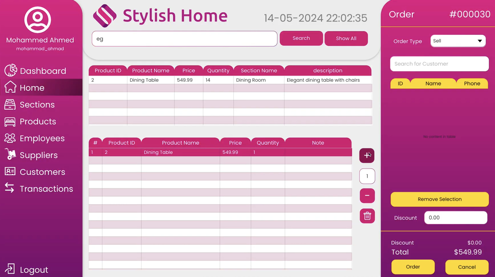

# Stylish Home SOP APP

## Overview

This is a JavaFX-based desktop application for managing a shop's operations, including products, employees, orders, suppliers, and customers. The application uses a PostgreSQL database and supports generating reports using JasperReports.

## Features

- Product, Employee, Section, Supplier, and Customer management (CRUD)
- Image upload for products and employees
- Order management and reporting
- JasperReports integration for PDF report generation
- JavaFX UI with FXML

## Project Structure

- `src/main/java/com/example/ourproject/`: Main Java source code
  - `Home.java`: Main controller for the dashboard and navigation
  - `Product.java`, `Emp.java`, `Section.java`, etc.: Entity and logic classes
  - `AddOrViewProduct.java`, `EmpStage.java`: Dialogs for adding/viewing/editing entities
- `src/main/resources/com/example/ourproject/`: Resources (FXML, images, etc.)
  - `ProductImages/`, `EmplyeesImages/`: Image folders
  - `UI/`: UI assets (e.g., `noImage.png`)
- `pom.xml`: Maven build file (dependencies: JavaFX, JasperReports, PostgreSQL, etc.)

## Main Classes

- `Application`
- `Home`
- `Product`
- `Emp`
- `EmpStage`
- `Section`
- `SectionStage`
- `Supplier`
- `SupplierStage`
- `Customer`
- `CustomerStage`
- `Order`
- `OrderItem`
- `OrderView`
- `ConfirmOrder`
- `Login`
- `Dialog`
- `DatabaseConnector`
- `HomeTab`
- `GenderType`

## Prerequisites

- Java 21+
- Maven
- PostgreSQL (with the required schema and tables)
- JavaFX SDK (if not using Maven JavaFX plugin)
- JasperReports libraries

## Setup Instructions

1. **Clone the repository**  
   `git clone <repo-url>`

2. **Configure the Database**

   - Ensure PostgreSQL is running.
   - Create the required database and tables as referenced in the code (e.g., `shop.Product`, `shop.emp`, etc.).
   - Update database connection settings if needed (see `DatabaseConnector.getConnection()`).

3. **Build the Project**

   - Run `mvn clean install` to build and resolve dependencies.

4. **Run the Application**

   - Use your IDE to run the main class (typically via an FXML launcher or `Home.java`).
   - Or use Maven:  
     `mvn javafx:run`

5. **Using the Application**
   - The UI allows you to manage products, employees, sections, suppliers, and customers.
   - You can add/edit/delete/view entities and upload images.
   - Generate and view reports using the provided buttons (PDFs will be created in the project directory).

## Demo Video

## Notes

- Image files are stored in `src/main/resources/com/example/ourproject/ProductImages/` and `EmplyeesImages/`.
- JasperReports templates (`.jrxml` files) must be present in the project root or as referenced in the code.
- Error dialogs and confirmations are handled via the custom `Dialog` class.

## Customization

- To change image storage locations, update the paths in `AddOrViewProduct.java` and `EmpStage.java`.
- To modify report templates, edit the corresponding `.jrxml` files.

## Troubleshooting

- If you encounter database connection errors, check your PostgreSQL credentials and schema.
- If images do not display, ensure the image files exist and paths are correct.
- For JavaFX runtime issues, ensure the JavaFX SDK is properly configured.

## License

This project is for educational/demo purposes.

---

**Tip:**  
To fully understand the code, review the main controller (`Home.java`), entity classes, and dialogs for each entity. The logic for CRUD operations and report generation is distributed across these files.
